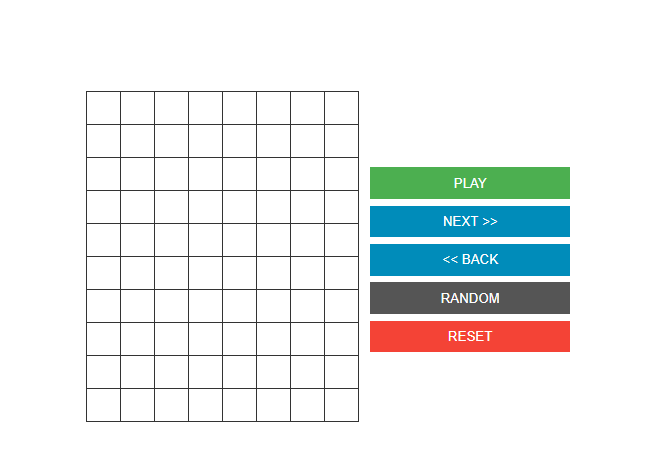

# Conway's Game of Life

This is my take on a classic. View in your web browser and play around with [Conway's Game of Life][wiki-cgol].

View a live demo [here](https://median-man.github.io/conways-gol/).

## Guide

Controls are provided to manipulate the game. Click on any cell in the grid to toggle the cell. Let the app automate each generation of the game or click `NEXT` to step through one at a time.

## Note

The history size is unbounded. You will eventually use up available memory if you leave
the page open and playing long enough.

[wiki-cgol]: https://en.wikipedia.org/wiki/Conway%27s_Game_of_Life
